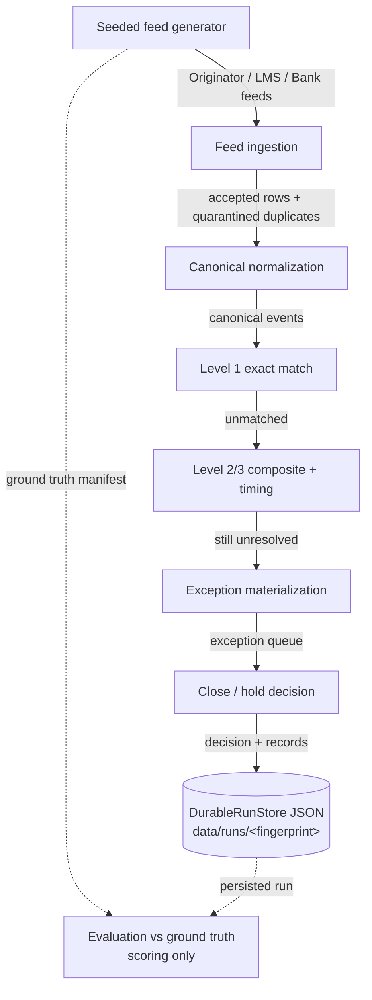

# Architecture

This document describes the Phase 1 co-lending reconciliation control tower: its components, the
data flow through the pipeline, the trust and persistence boundaries, and the reasoning behind the
major technology choices.

## System purpose

The control tower reconciles disbursements across three sources — Originator instructions, LMS
bookings, and Bank settlement records — records evidence and lineage, materializes unresolved
differences into an owned exception queue, and produces a deterministic close/hold decision so that
no unresolved financial exposure is silently written off or balanced away.

## Components

Each component is a package under `com.vivriti.controltower`. Responsibilities are deliberately
narrow so that a defect in one stage cannot silently mask a defect in another.

| Component | Package | Responsibility |
|-----------|---------|----------------|
| Seeded feed generator | `generator` | Produces deterministic synthetic Originator/LMS/Bank feeds and a ground-truth manifest for a given seed. Physically injects anomalies (missing rows, amount/status drift, duplicates, late arrivals) into the feed data, not just into ground-truth labels. |
| Feed ingestion | `ingestion` | Parses raw feed rows, validates schema and required fields, and quarantines malformed or duplicate rows. This is the trust boundary — nothing downstream sees unvalidated input. |
| Canonical normalization | `normalization` | Maps accepted rows from each source into one `CanonicalEvent` model with a stable business-event identity, so matching compares like against like. |
| Exact reconciliation (Level 1) | `matching` | `ExactReconciliationMatcher` — matches a business event only when identifiers, currency, amount (within INR 1.00 tolerance), event type, **source status**, and validation state all agree. |
| Composite + timing (Level 2/3) | `matching` | `CompositeAndTimingMatcher` — composite-key matching and grace-window timing resolution for events that do not exact-match. |
| Exception materialization | `exceptions` | `ExceptionMaterializer` creates one exception per unresolved business event, classified by observable evidence only (missing / timing / amount / status / duplicate). `ExceptionQueueService`, audit trail, and override services manage queue state. |
| Close / hold | `close` | `CloseHoldService` applies the deterministic hold formula against unresolved exposure and the batch total, producing a `CloseHoldDecision`. |
| Pipeline orchestration + persistence | `hardening` | `Phase1PipelineService` runs the full stage sequence; `DurableRunStore` persists canonical events, exceptions, audit entries, and the decision as JSON keyed by batch fingerprint. |
| Evaluation | `evaluation` | Scores a run against the generator's ground truth (scoring only), computes the scorecard, and compares two seeds. |
| Demo runner | `demo` | `PipelineDemo` is the testable end-to-end core; `DemoRunner` is the opt-in CLI entry point, active only under the `demo` Spring profile. |
| Domain model | `domain` | `CanonicalEvent`, `MatchingState`, `ValidationState`, `SourceSystem`, and related value types shared across stages. |

## Data flow

The concrete sequence inside `Phase1PipelineService.process(...)`:

1. **Fingerprint + idempotency check** — a deterministic batch fingerprint is computed. If the batch
   is already in memory or already persisted under `data/runs/<fingerprint>/`, the stored snapshot is
   returned without reprocessing (restart-safe idempotency).
2. **Ingest** each feed; malformed rows are rejected and duplicate Originator rows are quarantined.
3. **Normalize** accepted rows into canonical events.
4. **Level 1 exact reconciliation** over the canonical events.
5. **Level 2/3 composite + timing** reconciliation for the remainder.
6. **Materialize exceptions** — one exception per unresolved business event, plus a
   `DUPLICATE_EVENT` exception for each quarantined duplicate.
7. **Compute the batch total** from Originator canonical events only (the authoritative disbursement
   intent), avoiding triple-counting across sources.
8. **Close/hold decision** from unresolved exposure vs. the configured threshold.
9. **Persist** canonical events, exceptions, audit entries, and the decision atomically.

## Boundaries

- **Trust boundary at ingestion.** Schema validation and duplicate quarantine happen here. No
  downstream stage receives unvalidated data, so malformed input fails closed rather than corrupting
  reconciliation.
- **Evaluation boundary.** The ground-truth manifest is read *only* by the evaluation stage, and only
  to score a completed run. Matching and close/hold never see ground truth — they classify by
  observable evidence alone. This keeps the scorecard an independent check rather than a self-graded
  one.
- **Persistence boundary keyed by deterministic fingerprint.** Each batch maps to exactly one run
  directory. The fingerprint makes reprocessing idempotent and makes totals reproducible without
  rerunning the pipeline.
- **Authoritative-source boundary.** Originator is authoritative for disbursement intent (and for the
  batch total), LMS for booking status, Bank for settlement movement. Batch totals are computed from
  Originator only.

## Why file-based persistence instead of JPA/PostgreSQL

PostgreSQL/JPA was scaffolded in Milestone 1 but unused through Milestones 2–11. For Phase 1 the
persistence requirement is narrow: durable, reproducible run records (canonical events, exceptions,
audit entries, decision) that can be reloaded without rerunning the pipeline.

- **Effort.** Full JPA/PostgreSQL persistence was estimated at 3–5 days (schema, migrations,
  transactions, integration tests, container wiring). File-based JSON persistence was ~0.5–1 day.
- **Fit.** JSON files under `data/runs/<fingerprint>/` with atomic replacement satisfy the
  reproducible-totals and restart-safety requirements directly, and make idempotency demonstrable.
- **Cost avoided.** Keeping unused PostgreSQL/JPA/Docker/Testcontainers infrastructure would have been
  dead weight; it was removed rather than left as scaffolding.
- **Accepted trade-off.** File persistence is not suited to concurrent writers, ad-hoc querying, or
  retention management. Phase 1 is a single-operator sequential workflow, so those limits are
  acceptable and are recorded in [known-limitations.md](known-limitations.md). Full RDBMS persistence
  remains the natural Phase 2 upgrade.

See [decision-log.md](decision-log.md) for the full decision record.

## Why each major technology

- **Java 17** — long-term-support baseline with records and pattern matching, which suit the
  immutable canonical/value-object model used throughout the pipeline.
- **Spring Boot 3** — dependency injection, application lifecycle, and — critically for the demo —
  `@Profile`-gated components, which let the demo runner be strictly opt-in without a second `main`.
- **Maven** — standard, reproducible build and test lifecycle (`mvn test`, `mvn spring-boot:run`) that
  a fresh evaluator can run with only JDK 17 installed.
- **JUnit 5** — the full behavioural safety net (78 tests) that gates each milestone, including the
  end-to-end demo assertion on the HOLD decision and blocking value.
- **Jackson** — JSON serialization for the durable run store; no schema/migration overhead.

## Runtime prerequisites

JDK 17 and Maven only. No database, Docker, or external service is required for Phase 1. Durable state
is written under `data/runs/<fingerprint>/`, and `data/` is git-ignored.

## Production path (plan, not implemented)

A staged plan for taking this from a single-operator case study to a production control tower. None of
this is built; it is the intended path.

- **Monitoring / observability.** Structured logs per stage with the batch fingerprint as the
  correlation key; metrics for rows ingested/quarantined, matches by level, unresolved INR, close/hold
  outcome, and probabilistic surfaced/confirmed counts; alerts on control-total-integrity failures,
  exception-coverage < 1.0, and any HOLD. Every reported number stays recalculable from stored source
  + decision records (reproducible-totals control).
- **Ownership model.** Deterministic reconciliation owned by the Reconciliation/Finance-engineering
  team; the exception queue routed by the ownership table in [assumptions.md](assumptions.md) (Partner
  Ops, Finance, Engineering, Integration Engineering); the probabilistic stretch owned by a separate
  team so its changes cannot destabilize the deterministic path.
- **Staged rollout.** (1) Shadow mode — run against real feeds, produce reports, take no action.
  (2) Deterministic-only in production with close/hold advisory. (3) Enforce close/hold. (4) Enable
  probabilistic scoring in surface-only mode (no confirmation). (5) Enable human confirmation for a
  limited partner set, then expand. Each stage is gated on the prior stage's metrics.
- **Reconciliation approach.** Every batch carries an auditable count-and-value control: every source
  record is matched, pending-within-policy, or in the unresolved queue, and the Originator-based batch
  total reconciles against matched + pending + unresolved. Divergence blocks close.
- **Rollback plan.** Config-level: disable probabilistic matching (deterministic fallback is
  byte-identical to Phase 1) and revert threshold/weight config — no code change. Code-level: runs are
  immutable and keyed by fingerprint, so a bad release is rolled back by redeploying the prior version
  and reprocessing affected batches (idempotent — no double effects). No financial state is mutated in
  place, so rollback never corrupts prior decisions.
